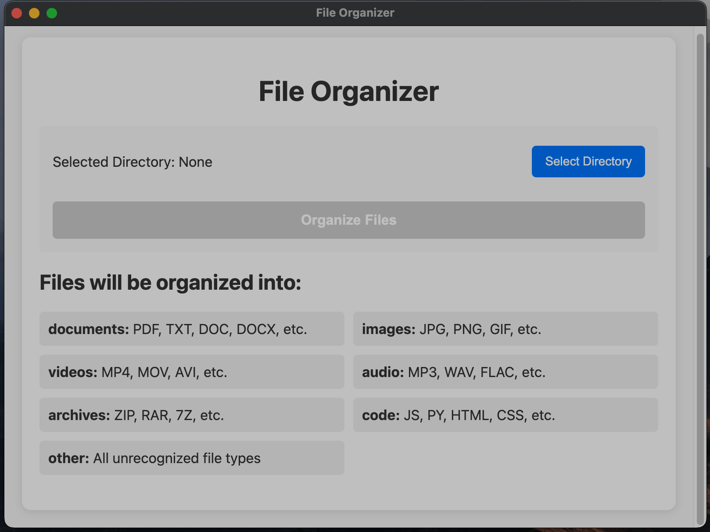

# File Organizer

A desktop application for Mac that automatically organizes files in a directory based on their file types.



## Features

- **Automatic File Organization**: Sorts files into appropriate folders based on file extension
- **Clean Interface**: Simple, intuitive user interface
- **Customizable**: Easily modify the file type categories
- **Safe Operation**: Original files are moved (not copied) to appropriate folders
- **Results Summary**: Complete report of all organized files and any errors

## File Categories

Files are automatically organized into the following folders:

- **documents**: PDF, TXT, DOC, DOCX, RTF, ODT, MD
- **images**: JPG, JPEG, PNG, GIF, BMP, TIFF, SVG, WEBP
- **videos**: MP4, MOV, AVI, MKV, WMV, FLV, WEBM
- **audio**: MP3, WAV, OGG, FLAC, AAC, M4A
- **archives**: ZIP, RAR, 7Z, TAR, GZ
- **code**: JS, PY, HTML, CSS, JAVA, CPP, C, PHP, RB
- **other**: All unrecognized file types

## Installation

### Prerequisites
- macOS 10.13 or later
- Node.js 14 or later (for development only)

### Download and Install

#### Option 1: Download the Pre-built App
1. Go to the [Releases](https://github.com/sakil470004/file-organizer-app-mac/releases) page
2. Download the latest `.dmg` file
3. Open the DMG file and drag the application to your Applications folder

#### Option 2: Build from Source
1. Clone the repository
   ```bash
   git clone https://github.com/sakil470004/file-organizer-app-mac.git
   cd file-organizer
   ```

2. Install dependencies
   ```bash
   npm install
   ```

3. Build the application
   ```bash
   npm run build
   ```

4. The built application will be in the `dist` folder

## Usage

1. Launch File Organizer from your Applications folder
2. Click "Select Directory" to choose the folder you want to organize
3. Click "Organize Files" to start the organization process
4. View the results showing which files were moved and any errors that occurred

## Development

### Setup Development Environment
```bash
# Clone the repository
git clone https://github.com/sakil470004/file-organizer-app-mac.git
cd file-organizer

# Install dependencies
npm install

# Start the application in development mode
npm start
```

### Project Structure
```
file-organizer/
├── package.json        # Project configuration
├── main.js             # Electron main process
├── preload.js          # Secure bridge between renderer and main
├── renderer.js         # Frontend logic
├── index.html          # User interface
└── styles.css          # Application styling
```

### Customizing File Types
To add or modify file type categories, edit the `fileTypes` object in `main.js`:

```javascript
const fileTypes = {
  documents: ['.pdf', '.txt', '.doc', '.docx', '.rtf', '.odt', '.md'],
  // Add or modify categories and extensions here
};
```

## Building for Distribution
```bash
npm run build
```

This will create distributable packages in the `dist` folder.

## Contributing

Contributions are welcome! Please feel free to submit a Pull Request.

1. Fork the repository
2. Create your feature branch (`git checkout -b feature/amazing-feature`)
3. Commit your changes (`git commit -m 'Add some amazing feature'`)
4. Push to the branch (`git push origin feature/amazing-feature`)
5. Open a Pull Request

## License

This project is licensed under the MIT License - see the LICENSE file for details.

## Acknowledgments

- Electron.js for making cross-platform desktop apps possible with web technologies
- fs-extra for enhanced file system operations